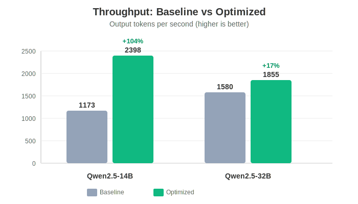
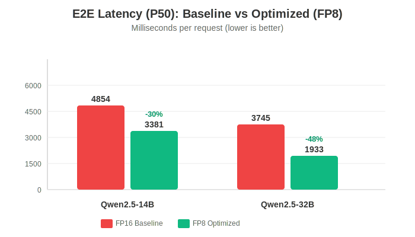
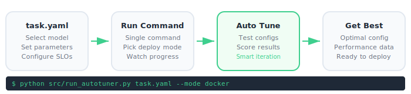
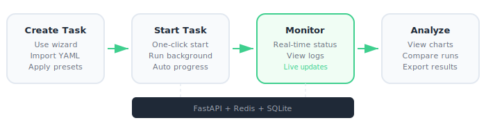
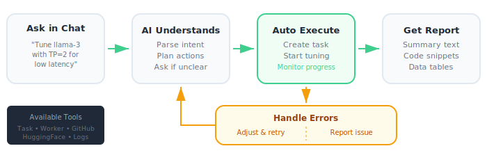
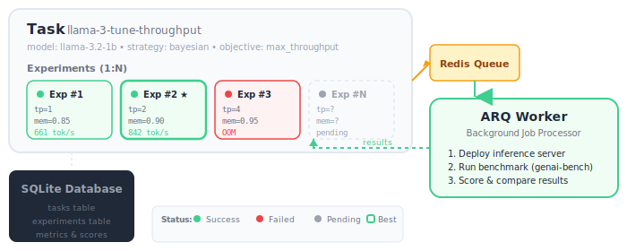

# LLM Autotuner (for inference)

<p align="center">
  
</p>

Automated parameter tuning for LLM inference engines (SGLang, vLLM) for best performance, while respecting SLOs and hardware constraints.

## Why Autotuner?

**Quantization and parameter tuning can unlock 60%+ performance gains.** LLM inference engines like SGLang and vLLM ship with conservative defaults that work everywhere but are optimized for nowhere.

### Performance Impact: Real-World Data

<p align="center">
  
</p>

<p align="center">
  
</p>

Testing on NVIDIA RTX 4090 (24GB) with typical production workloads (concurrency=32, mixed prefill/decode):

| Model | Metric | FP16 Baseline | AWQ-Marlin (INT4) | Improvement |
|-------|--------|---------------|-------------------|-------------|
| **Qwen2.5-14B** | Throughput | 1002 tok/s | 1661 tok/s | **+66%** |
| | P50 Latency | 7001 ms | 4513 ms | **-36%** |
| **Qwen2.5-32B** | Throughput | 730 tok/s | 1037 tok/s | **+42%** |
| | P50 Latency | 8388 ms | 5919 ms | **-29%** |

**See detailed benchmarks:** [Baseline Benchmarks](docs/qwen-baseline-benchmarks.md)

| What You Get | Manual Tuning | Autotuner |
|--------------|---------------|-----------|
| **Time to optimal config** | Hours to Days | **Minutes** |
| **Parameter combinations tested** | ~10 (limited by patience) | **50-100+** (automated) |
| **Performance gain** | Unknown (untested) | **60%+ throughput** (quantization + tuning) |
| **Reproducibility** | Low (manual errors) | **High** (versioned configs) |
| **Cross-hardware portability** | Manual rework | **Re-run task** (one command) |

**Stop leaving performance on the table.** Let Autotuner find your optimal configuration while you focus on building features.

## How to Use

### CLI Mode
<p align="center">
  
</p>

### Web UI Mode
<p align="center">
  
</p>

### Agent Mode
<p align="center">
  
</p>

## Core Concepts
<p align="center">
  
</p>

- **Task**: A tuning job containing model config, parameter ranges, SLOs, and optimization strategy
- **Experiment**: Individual trial with specific parameter values; multiple experiments per task
- **ARQ Worker**: Background processor that deploys models, runs benchmarks, and scores results

## Features

- **Multiple Deployment Modes**: Docker, Local (direct GPU), OME (Kubernetes)
- **Web UI**: React frontend with real-time monitoring
- **Agent Assistant**: LLM-powered assistant for task management and troubleshooting
- **Optimization Strategies**: Grid search, Bayesian optimization
- **SLO-Aware Scoring**: Exponential penalties for constraint violations

## Quick Start

**→ [Get started in 5 minutes with Docker](docs/getting-started/quickstart.md)**

```bash
# Install
pip install -r requirements.txt && pip install genai-bench

# Run
python src/run_autotuner.py examples/docker_task.yaml --mode docker
```

## Web UI

```bash
# Start backend + worker
./scripts/start_dev.sh

# Start frontend (separate terminal)
cd frontend && npm run dev
```

Access at http://localhost:5173

## Documentation

[**Full Documentation**](https://novitalabs.github.io/autotuner/)

### Project Overview
- [ROADMAP.md](docs/architecture/roadmap.md) - **Product roadmap with completed milestones and future plans**

### Setup & Deployment
- [Installation Guide](docs/getting-started/installation.md) - **Complete installation guide**
- [Quick Start](docs/getting-started/quickstart.md) - Quick start tutorial
- [Docker Mode](docs/user-guide/docker-mode.md) - Docker deployment guide
- [Kubernetes/OME](docs/user-guide/kubernetes.md) - Kubernetes/OME setup

### Features & Configuration
- [SLO Scoring](docs/features/slo-scoring.md) - SLO-aware scoring with exponential penalties
- [Parallel Execution](docs/features/parallel-execution.md) - Parallel experiment execution
- [WebSocket Implementation](docs/features/websocket.md) - Real-time updates via WebSocket
- [Quantization Parameters](docs/UNIFIED_QUANTIZATION_PARAMETERS.md) - Quantization configuration
- [Parameter Presets](docs/user-guide/presets.md) - Parameter preset system
- [Bayesian Optimization](docs/features/bayesian-optimization.md) - Bayesian optimization strategy
- [GPU Tracking](docs/features/gpu-tracking.md) - GPU intelligent scheduling

### Operations & Troubleshooting
- [Troubleshooting](docs/troubleshooting.md) - Common issues and solutions

### Development History
- [agentlog/](agentlog/) - Daily development diary (yyyy/mmdd.md format) written directly to files

## Contributing

See [DEVELOPMENT](docs/DEVELOPMENT.md) for development guidelines and project architecture.
